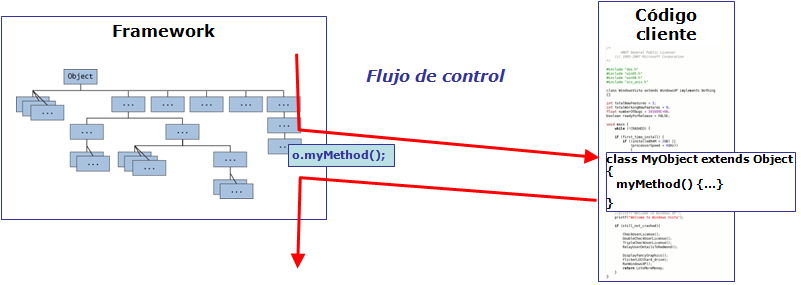
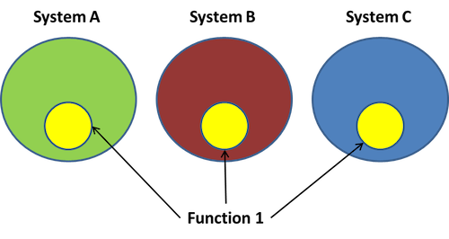
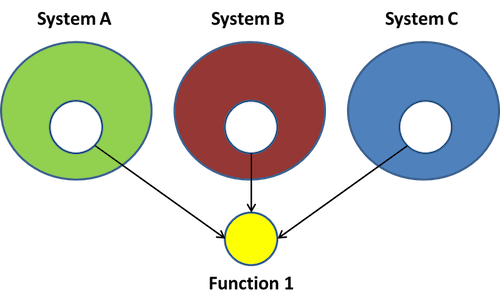
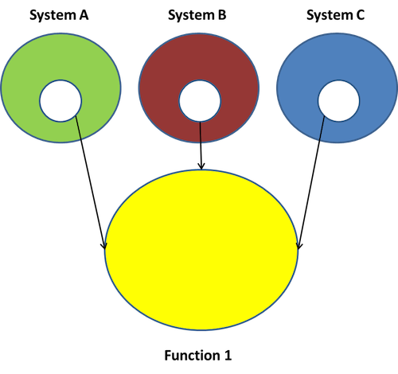
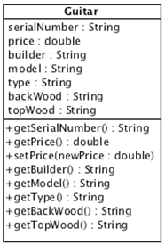

# Diseño de Sistemas Software

## Temas

### __Problemáticas__
 - Variabilidad
 - Acoplamiento
 - Complejidad
 - Robustez
 - <span style="color:blue;">Reutilización</span>
 - <span style="color:blue;">Flexibilidad</span>

### __Principios y técnicas__
 - <span style="color:blue;">Ocultación</span>
 - <span style="color:blue;">Cohesión</span>
 - <span style="color:blue;">Delegación</span>
 - <span style="color:blue;">Refactoring</span>
 - Bibliotecas

### __Paradigmas__
 - <span style="color:blue;">Objetos</span>
 - Aspectos


# Caso práctico
<a id="handler"></a>
## Identificadores 

### Versión inicial: Identificadores v0.1

```java
  class Empleado {
    private int dni;
    Empleado (String dni) throws NumberFormatException {
      this.dni = new Integer(dni).intValue();
    }
    int getDni() {
      return dni;
    }
    public String toString() {
      return new Integer(dni).toString();
    }
    public int compareTo(Empleado otro) {
       return this.dni - otro.getDni();
    }
    public boolean equals(Empleado otro) {
       return dni==otro.getDni();
    }
  }
```      

####Críticas:

- __Flexibilidad__: El Real Decreto 338/1990 regula el uso de NIFs en lugar de DNIs. ¡Hay que cambiar toda la implementación!


### Implementación alternativa: Identificadores v0.2

```java
  class Empleado {
    private String nif;
    Empleado (String nif) {
      this.nif = nif
    }
    int getNif() { return id; }
    public String toString() { return nif; }
    public int compareTo(Empleado otro) {
       return nif.compareTo(otro.getNif());
    }
    public boolean equals(Empleado otro) {
       return nif.equals(otro.getId());
    }
  }
```      

####Críticas:

- __Reutilización__: Posiblemente haya más situaciones (algunas futuras) donde hagan falta _identificadores_ que incluso pueden cambiar. Por ejemplo: números de la seguridad social, tarjetas de identidad, números de cuenta corriente, IBAN, etc.

### Hacemos refactoring: patrón *handler*

-   Manejo de *identificadores* de forma independiente de la
    implementación del objeto identificado.

-   Cambio fácil de implementación de los identificadores (`int`,
    `String`, etc.) hacia cualquier tipo básico o clase primitiva,
    sencilla o compuesta.


## Patrón Handler


- __Identifiable__: Clase cliente que necesita identificar a sus objetos a 
  través de algún atributo identificador

- __Handler__: Interfaz para declarar los identificadores de los objetos de
   la clase `Identifiable`

- __ConcreteHandler__: Implementación concreta de la interfaz `Handler`


### Implementación del patrón

```java
  interface Handler{
      String toString();
      int compareTo(Handler otro);
  }
  class Identificador implements Handler {
    private int id;
    Identificador (String id) throws NumberFormatException {
      this.id = new Integer(id).intValue();
    }
    public String toString() {
      return new Integer(id).toString();
    }
    public int compareTo(Handler otro) {
      return toString().compareTo(otro.toString());
    }
  }
```


## Ejercicio: `java.lang.Comparable`

Implementar un identificador utilizando `java.lang.Comparable` del JDK.

`Comparable` es una interfaz implementada por `String`, `File`, `Date`, etc. y todas las llamadas _clases de envoltura_ del JDK (i.e. `Integer`, `Long`, etc.)

__Métodos de la interfaz__:

```java
  public int compareTo(Object o) throws ClassCastException
```

__Invariantes:__

`sgn(x.compareTo(y)) = -sgn(y.compareTo(x))`\
`(x.compareTo(y)>0 and y.compareTo(z)>0)` $$\Rightarrow$$
`x.compareTo(z)>0`\
`x.compareTo(y)=0` $$\Rightarrow$$
`sgn(x.compareTo(z))=sgn(y.compareTo(z))` $$\forall$$ `z`

__Consistencia con `equals`__:

`(x.compareTo(y)=0)`
$$\Leftrightarrow$$ `(x.equals(y))`


##Reutilización y flexibilidad

-  __Flexibilidad__: Adaptarse a cambios de requisitos y construir 
       software fácil de cambiar
-  __Reutilización__: Construir software fácil de reutilizar sin
       tener que cambiar los módulos ya escritos


## Bibliotecas y frameworks

### Biblioteca


### Frameworks

#### Definición de *framework*

> Colección de clases e interfaces que cooperan para formar un diseño reutilizable de un tipo específico de software
> 
> -- <cite>[E. Gamma et al.](#gamma)</cite>

-   El framework proporciona unas guías arquitectónicas (diseño empaquetado): para dividir el diseño en clases abstractas y definir sus responsabilidades y colaboraciones.
-   El framework se debe personalizar definiendo subclases y combinando
    instancias


#### Principios de diseño

-   Datos encapsulados
-   Interfaces y clases abstractas
-   Métodos polimórficos
-   Delegación

#### Herramientas de diseño

-   __Patrones__: elementos reutilizables de diseño 
-   __Frameworks__: colecciones de patrones abstractos a aplicar


#### Framework vs. biblioteca

-   API orientado a objetos
-   Flujo de control invertido
-   Programador cliente (código específico) vs. de programador de bibliotecas (código reutilizable)

#### Flujo de control en un framework




### Principios de diseño de un framework

-   Abstracción
    -   Clases y componentes abstractos
    -   Interfaces abiertas
    -   Uso de patrones de diseño

-   Máxima cohesión, mínimo acoplamiento
    -   Componentes de un dominio específico
    -   Minimizar dependencias
    -   Inyección de dependencias

-   Inversión de control
    -   Principio de Hollywood


# Caso práctico
<a id="junit"></a>
## Framework jUnit

-   JUnit es un framework en Java que sirve para diseñar, construir y
    ejecutar **pruebas unitarias**
-   Una prueba unitaria comprueba la corrección de un
    _módulo_ de software en cuanto a funcionalidades
    que ofrece.
-   En el caso de Java, las pruebas unitarias comprueban la corrección
    de cada uno de los métodos de _cada clase_.
-   ¿Cómo funciona?


### ¿Cómo probar `Saludo.java`?

Incluir un método `main` que pruebe la funcionalidad de la clase:

```java
class Saludo {
	/**
	* Imprime "Hola Mundo!"
	*/
	void saludar() {
		System.out.println("Hola Mundo!");
	}
	/**
	* Imprime un mensaje
	*/
	void saludar(String mensaje) {
		System.out.println(mensaje);
	}
	
	/**
	* Tests
	*/
	public static void main( String[] args ) {
		Saludo saludo1 = new Saludo();
		saludo1.saludar();
		
		Saludo saludo2 = new Saludo("Hola caracola!");
		saludo2.saludar();
	}
}
```

### Pegas

-   Cuanto más grande sea la interfaz de la clase, mayor será el main

-   El tamaño del código de la clase crece por las pruebas

-   Poco fiable, porque main forma parte de la misma clase y tiene
    acceso a los elementos privados

-   Difícil de automatizar las pruebas, incluso pasando argumentos a
    main


### Saludo: Caso de prueba jUnit

      import junit.framework.*;
      /**
      * Caso de prueba de JUnit para Saludo
      */
      public class SaludoTest extends TestCase {
        public SaludoTest(String nombre) {
          super(nombre);
        }
        public static void main(String args[]) {
          junit.textui.TestRunner.run(HolaMundoTest.class);
        }
        public void testSaludar() {
          Saludo hola = new Saludo();
          assert( hola!=null );
          assertEquals("Hola Mundo!", hola.saludar() );
        }
      }
     

### Ejemplo: Prueba unitaria de ShoppingCart

-   Probar Carrito de la compra

-   Probar validación de tarjetas de crédito

-   Probar manejo de varias monedas

-   Etc.

#### ShoppingCart

```java
  public class ShoppingCart {
      private ArrayList items;
      public ShoppingCart() { ... }
      public double getBalance() { ... }
      public void addItem(Product p) { ... }
      public void removeItem(Product p)
          throws ProductNotFoundException { ... }
      public int getItemCount() { ... }
      public void empty() { ... }
      public boolean isEmpty() { ... }
  }
```      

#### ShoppingCartTestCase

```java
public class ShoppingCartTestCase extends TestCase {
  private ShoppingCart bookCart;
  private Product defaultBook;
  //...
  protected void setUp() {
      bookCart = new ShoppingCart();
      defaultBook = new Product("Extreme Programming", 23.95);
      bookCart.addItem(defaultBook);
  }
  protected void tearDown() {
      bookCart = null;
  }  
  public void testEmpty() {
      bookCart.empty();
      assertTrue(bookCart.isEmpty());
  }
  public void testProductAdd() {
      Product book = new Product("Refactoring", 53.95);
      bookCart.addItem(book);
      double expectedBalance = defaultBook.getPrice() + book.getPrice();
      assertEquals(expectedBalance, bookCart.getBalance(), 0.0);
      assertEquals(2, bookCart.getItemCount());
  }
  public void testProductRemove() throws ProductNotFoundException {
      bookCart.removeItem(defaultBook);
      assertEquals(0, bookCart.getItemCount());
      assertEquals(0.0, bookCart.getBalance(), 0.0);
  }
  public void testProductNotFound() {
      try {
          Product book = new Product("Ender's Game", 4.95);
          bookCart.removeItem(book);
          fail("Should raise a ProductNotFoundException");
      } catch(ProductNotFoundException success) {
          ...
      }
  }
  public static Test suite() {
      // Reflection is used here to add all
      // the testXXX() methods to the suite.
         TestSuite suite = new TestSuite(ShoppingCartTestCase.class);
      // Alternatively, but prone to error when adding more
      // test case methods...
      // TestSuite suite = new TestSuite();
      // suite.addTest(new ShoppingCartTestCase("testProductAdd"));
      // suite.addTest(new ShoppingCartTestCase("testEmpty"));
      // suite.addTest(new ShoppingCartTestCase("testProductRemove"));
      // suite.addTest(new ShoppingCartTestCase("testProductNotFound"));
         return suite;
  }
}
```      

#### EcommerceTestSuite

```java
  public class EcommerceTestSuite extends TestSuite {
      //...
      public static Test suite() {
          TestSuite suite = new TestSuite();
          suite.addTest(ShoppingCartTestSuite.suite());
          suite.addTest(CreditCardTestSuite.suite());
          // etc.
          return suite;
      }
      public static void main(String args[]) {
          junit.textui.TestRunner.run(suite());
      }
  }
```      

### Arquitectura del framework


En la arquitectura del framework se observan diversos patrones: Composite, Command, Adapter, etc.


# Caso práctico
<a id="caballeros"></a>
### Ejemplo: Caballeros de la mesa redonda

Añadir pruebas unitarias a la solución siguiente:

```java
public class KnightOfTheRoundTable {
  private String name;
  private HolyGrailQuest quest;
  public KnightOfTheRoundTable(String name) {
    this.name = name;
    quest = new HolyGrailQuest();
  }
  public HolyGrail embarkOnQuest()
      throws GrailNotFoundException {
    return quest.embark();
  }
}
  

public class HolyGrailQuest {
  public HolyGrailQuest() {}
  public HolyGrail embark()
          throws GrailNotFoundException {
  HolyGrail grail = null;
    // Look for grail
    ...
    return grail;
  }
}  
```      

### Pruebas unitarias

¿Dónde está el acoplamiento?

```java
import junit.framework.TestCase;
public class KnightOfTheRoundTableTest
       extends TestCase {
  public void testEmbarkOnQuest()
         throws GrailNotFoundException {
    KnightOfTheRoundTable knight =
        new KnightOfTheRoundTable("CruzadoMagico");
    HolyGrail grail = knight.embarkOnQuest();
    assertNotNull(grail);
    assertTrue(grail.isHoly());
  }
}
```      

-   Instanciación de `HolyGrail`

-   Cada vez que se prueba `KnightOfTheRoundTable`, también se prueba
    `HolyGrailQuest`.

-   No se puede pedir a `HolyGrailQuest` que se comporte de otra
    forma (v.g. devolver null o elevar una excepción)


### Ejemplo: Caballeros de la mesa redonda

Ocultar la implementación detrás de una interfaz:

```java
public interface Knight {
  Object embarkOnQuest()
    throws QuestFailedException;
}
    
public class KnightOfTheRoundTable
       implements Knight {
  private String name;
  private Quest quest;
  public KnightOfTheRoundTable(String name) {
    this.name = name;
    quest = new HolyGrailQuest();
  }
  public Object embarkOnQuest()
       throws QuestFailedException {
    return quest.embark();
  }
}    

public interface Quest {
  abstract Object embark()
    throws QuestFailedException;
}
    
public class HolyGrailQuest implements Quest {
  public HolyGrailQuest() {}
  public Object embark()
       throws QuestFailedException {
    // Do whatever it means to embark on a quest
    return new HolyGrail();
  }
}
```  

-   El Knight aún recibe un tipo específico de Quest
-   ¿Debe ser el caballero responsable de obtener un desafío?


### Ejemplo: Caballeros de la mesa redonda

```java
public class KnightOfTheRoundTable
       implements Knight {
  private String name;
  private Quest quest;
  public KnightOfTheRoundTable(String name) {
    this.name = name;
  }
  public Object embarkOnQuest()
       throws QuestFailedException {
    return quest.embark();
  }
  public void setQuest(Quest quest) {
    this.quest = quest;
  }
}
```  

-   El caballero sólo sabe del desafío a través de su interfaz `Quest`.

-   Puede asignársele cualquier implementación de `Quest`
    (`HolyGrailQuest`, `RescueDamselQuest`, etc.)


## Inyección de dependencias


-   Se basa en la inversión del control
-   M. Fowler (2004): ¿Qué aspecto del control se invierte? La
    adquisición de dependencias
-   Una aplicación son dos o más clases que colaboran.
-   Los objetos deben recibir las dependencias en su creación, por parte
    de una entidad externa que coordina los objetos.
-   Inversión de la responsabilidad de cómo un objeto obtiene
    referencias a los objetos con los que colabora
-   Bajo acoplamiento: un objeto sólo sabe de sus dependencias por su
    interfaz, no por su implementación ni por cómo fueron instanciados.
    Entonces la dependencia puede cambiarse por una implementación
    distinta


# Discusión sobre la reutilización

> We most likely would have been better off not attempting to create a reusable function in the first place 
> 
> -- <cite>Roger Sessions, The Misuse of Reuse [1]</cite>


[1] http://simplearchitectures.blogspot.com.es/2012/07/misuse-of-reuse.html


### Factorizar una función





#### Ventajas (supuestas) de reutilizar:

__Ahorro__: Si $$\exists s$$ sistemas $$\wedge ~ coste(Function~1) = c$$ €

$$\Rightarrow$$
ahorro = $$c \times (s-1)$$ €


#### Amenazas (reales):



- Realmente el ahorro depende de la __complejidad__. Y muchas veces, la complejidad de la función está exponencialmente relacionada con el número de sistemas.
- Con un único punto de fallo, Si la función 1 falla, todos los sistemas pueden fallar a la vez.
- La seguridad es inversamente proporcional a la complejidad del sistema.
- Se incrementan los costes de llevar los sistemas a la nube.

####Conclusión

No crear funciones reutilizables en primer lugar

Aplicar el principio __YAGNI__: __You Ain't Gonna Need It__


# Caso práctico
<a id="guitarras"></a>

## Guitarras Paco

El cliente (Paco) quiere:

-   Mantener un inventario de guitarras

-   Encontrar guitarras para sus clientes

Problemas de la aplicación heredada:

-   Caso de uso: un cliente busca una guitarra flamenca ‘Valeriano
    Bernal’, pero no encuentra ninguna

-   ¿Problemas?

### Una aplicación heredada





### Implementación: Guitarra

```java
  public class Guitar {     
     private String serialNumber, builder, model, type, backWood, topWood;
     private double price;
        
     public Guitar(String serialNumber, double price,
                        String builder, String model, String type,
                        String backWood, String topWood) {
        this.serialNumber = serialNumber;
        this.price = price;
        this.builder = builder;
        this.model = model;
        this.type = type;
        this.backWood = backWood;
        this.topWood = topWood;
     }
          
     public String getSerialNumber() {return serialNumber;}
     public double getPrice() {return price;}
     public void setPrice(float newPrice) {
        this.price = newPrice;
     }
     public String getBuilder() {return builder;}
     public String getModel() {return model;}
     public String getType() {return type;}
     public String getBackWood() {return backWood;}
     public String getTopWood() {return topWood;}
  }
```      


### Implementación: Inventario

```java
public class Inventory {
  private List guitars;
  public Inventory() { guitars = new LinkedList(); }
  public void addGuitar(String serialNumber, double price,
                        String builder, String model,
                        String type, String backWood, String topWood) {
    Guitar guitar = new Guitar(serialNumber, price, builder,
                               model, type, backWood, topWood);
    guitars.add(guitar);
  }
  public Guitar getGuitar(String serialNumber) {
    for (Iterator i = guitars.iterator(); i.hasNext(); ) {
      Guitar guitar = (Guitar)i.next();
      if (guitar.getSerialNumber().equals(serialNumber)) {
        return guitar;
      }
    }
    return null;
  }
  public Guitar search(Guitar searchGuitar) {
    for (Iterator i = guitars.iterator(); i.hasNext(); ) {
      Guitar guitar = (Guitar)i.next();
      String builder = searchGuitar.getBuilder().toLowerCase();
      if ((builder != null) && (!builder.equals("")) &&
          (!builder.equals(guitar.getBuilder().toLowerCase())))
        continue;
      String model = searchGuitar.getModel().toLowerCase();
      if ((model != null) && (!model.equals("")) &&
          (!model.equals(guitar.getModel().toLowerCase())))
        continue;
      String type = searchGuitar.getType().toLowerCase();
      if ((type != null) && (!searchGuitar.equals("")) &&
          (!type.equals(guitar.getType().toLowerCase())))
        continue;
      String backWood = searchGuitar.getBackWood().toLowerCase();
      if ((backWood != null) && (!backWood.equals("")) &&
          (!backWood.equals(guitar.getBackWood().toLowerCase())))
        continue;
      String topWood = searchGuitar.getTopWood().toLowerCase();
      if ((topWood != null) && (!topWood.equals("")) &&
          (!topWood.equals(guitar.getTopWood().toLowerCase())))
        continue;
      return guitar;
    }
    return null;
  }
}
```      

## Algunos problemas

-   Se compara el fabricante sin tener en cuenta mayúsculas/minúsculas

-   Se comparan todos los campos sin tener en cuenta
    mayúsculas/minúsculas

-   No hay definidas constantes para cada fabricante

¿Estas soluciones abordan el verdadero problema?

Preguntar a Paco...


### Preguntar al cliente

Preguntemos a Paco, que no tiene por qué saber nada de objetos ni bases
de datos:

-   ¿Sólo vendes guitarras?

-   ¿Cómo actualizas el inventario?

-   ¿Cómo funciona la búsqueda de guitarras?

-   ¿Necesitarás informes de inventario y de ventas?

### Respuestas del cliente

Paco dice que:

-   Los clientes no siempre conocen las características exactas de la
    guitarra que quieren

-   Los clientes suelen buscar guitarras dentro de un rango de precios

-   Suele haber más de una guitarra que casa con las necesidades del
    cliente

-   Sí, necesito informes y demás, pero ¡la prioridad nº 1 es encontrar
    las guitarras!

## Ejercicio

Hacer refactoring de la aplicación heredada de Guitarras Paco

